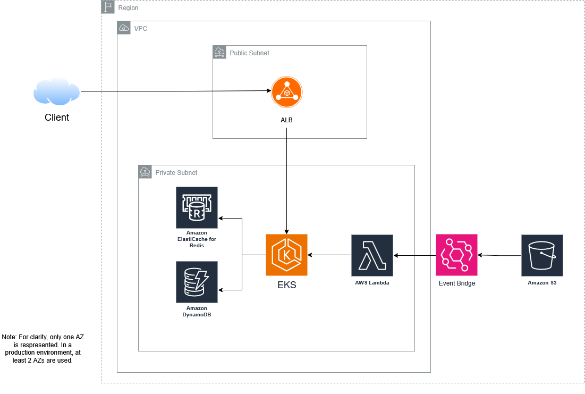

# Order Management Challenge

According to the requirements, I chose the following architecture:

* An Application Load Balancer to expose the API on Internet. It also allows to terminate the SSL connection and send traffic to the API.

* A container orchestrator (EKS) to achieve a high resiliency and a smooth rollout for the API. AWS ECS would be a valid choice in our use case but I consider EKS a more flexible solution. Application pods can scale in and out with an HPA based on CPU usage.

* AWS Elasticache Redis in order to store orders and get order books. This helps to address the 5ms constraint even with a write operation because it is an in-memory data store.

* AWS DynamoDB in order to have a permanent storage for the orders. These latter can be written after the Elasticache operation and asynchronously in the database, so answer’s time is not impacted.

* A S3 bucket to manage the bulk load feature.

* A Lambda function that will be triggered by Event Bridge when a file is uploaded on S3. The function will query the API. It is configured to have an interface in the VPC.

* The use of Elastic Network Adapter for the EC2 instances of the EKS cluster. It allows to bypass the virtualization layer, giving a better latency.
